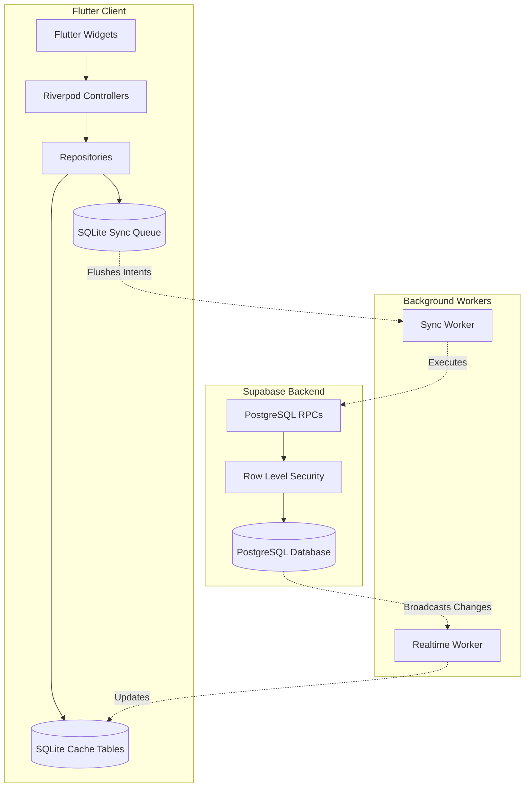
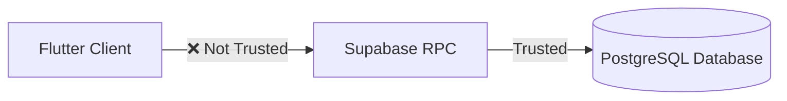
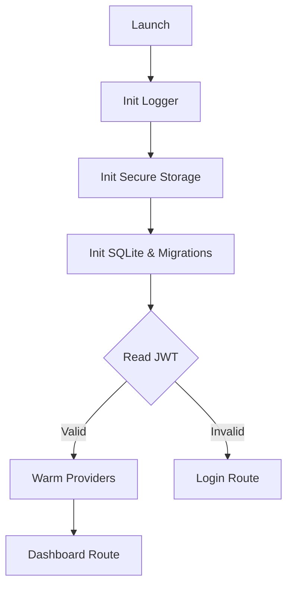
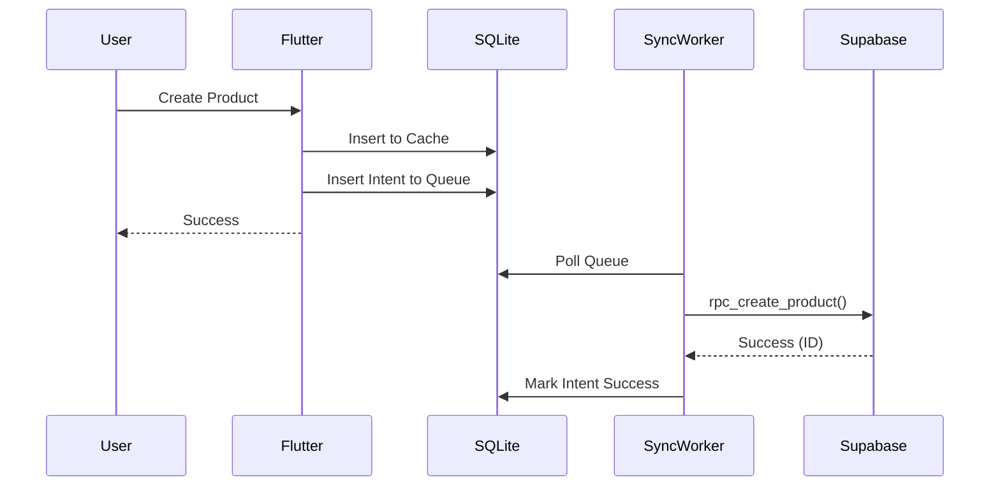
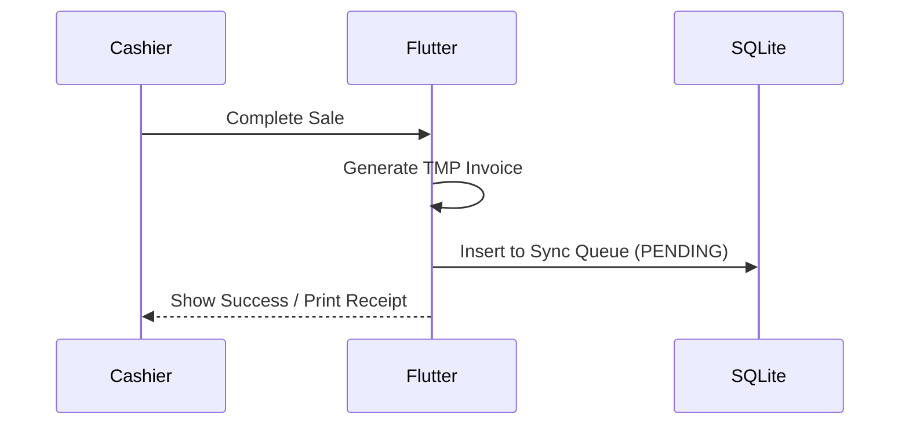
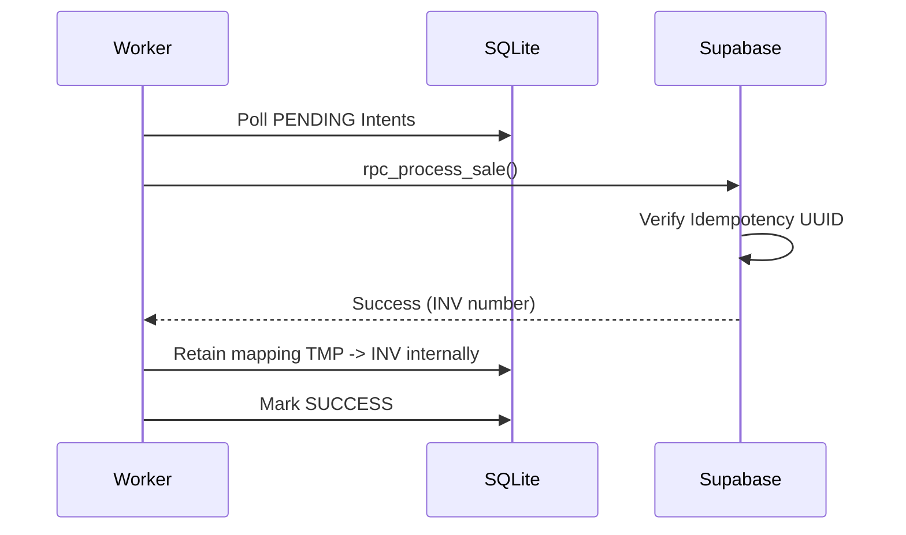
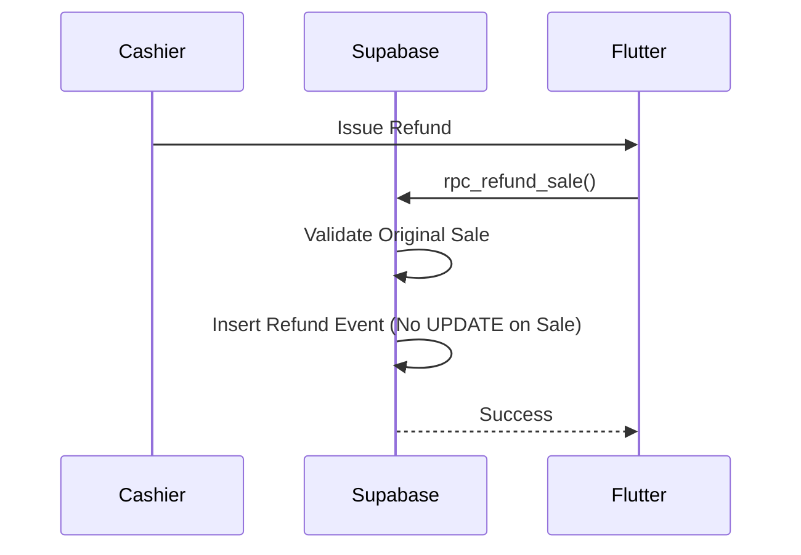
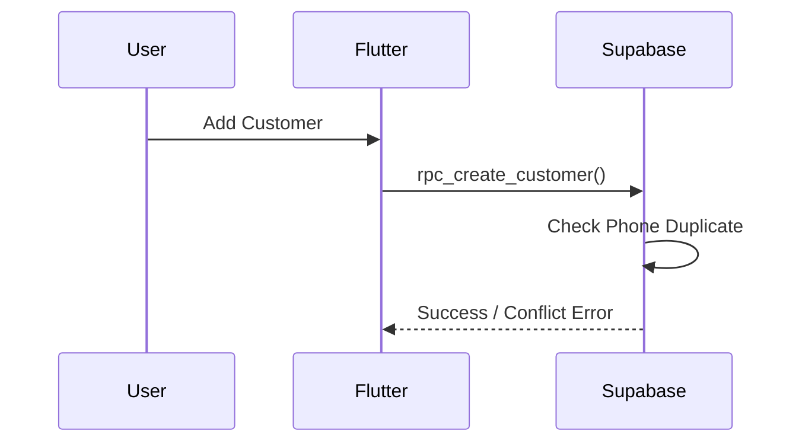

# System Architecture Document — StoreMate

| Field        | Value                                              |
|--------------|----------------------------------------------------|
| Version      | 1.2                                                |
| Status       | Locked                                             |
| Owner        | Pratik Khose                                       |
| Last Updated | 2026-09-09                                         |
| Audience     | Engineering, Architecture, QA                      |
| Dependencies | 01-PRD.md, 02-TRD.md, Engineering-Principles.md    |

> [!IMPORTANT]
> This document maps the technical contracts from `02-TRD.md` into concrete system topologies, data flows, sequence diagrams, and ownership models. It serves as the comprehensive and frozen implementation blueprint.

---

## 1. The Architecture Constitution

These are the 10 immutable architectural laws of the StoreMate codebase.

1. **Flutter owns presentation.** It never computes authoritative business logic.
2. **SQLite owns the cache.** It is the authoritative local cache during offline operation. PostgreSQL remains the global source of truth.
3. **The Queue owns writes.** All mutations pass through the SQLite Sync Queue.
4. **RPCs own business rules.** Supabase RPCs validate and process every transaction.
5. **Postgres owns truth.** The server is the ultimate authority during sync reconciliation.
6. **Triggers own projections.** Ledger aggregations (e.g., current stock) are calculated by DB triggers.
7. **Constraints own integrity.** DB constraints enforce data types, precision, and required relations.
8. **The Ledger owns history.** Financial and inventory records are append-only. No `UPDATE`.
9. **Workers own synchronization.** Background workers manage queue flushing without UI intervention.
10. **Widgets never know persistence.** UI components never touch SQLite, Supabase, or DTOs directly.

---

## 2. High-Level System Context



### 2.1 Security Boundaries (Trust Diagram)

Security boundaries begin exactly at the RPC layer. The client is never trusted to enforce access control.

---

## 3. Application Layers & Ownership

To prevent architecture rot, dependency flow is strictly unidirectional.

### 3.1 Allowed vs. Forbidden Dependencies

**Allowed Flow:**
`Widget $\rightarrow$ Controller $\rightarrow$ Repository $\rightarrow$ RPC / SQLite`

**Forbidden Flow:**
- ❌ `Widget $\rightarrow$ Repository` (Bypasses Controller state).
- ❌ `Widget $\rightarrow$ SQLite / RPC` (Direct DB access from UI).
- ❌ `Controller $\rightarrow$ RPC / SQLite` (Business logic leak).
- ❌ `Repository $\rightarrow$ Repository` (Spaghetti coupling).
- ❌ `RPC $\rightarrow$ Flutter` (Backend cannot push UI events; must use Realtime $\rightarrow$ SQLite).

### 3.2 Domain Model Rules
Data structures must be transformed at the Repository boundary.
- **Allowed:** `JSON (API) $\rightarrow$ DTO $\rightarrow$ Repository $\rightarrow$ Freezed Domain Model $\rightarrow$ Widget`
- **Forbidden:** ❌ `JSON $\rightarrow$ Widget` or ❌ `SQLite Row $\rightarrow$ Widget`.

### 3.3 Event Bus / Reactivity Flow
StoreMate does not use an external Event Bus (like RxDart streams) for state updates.
- **Flow:** `Worker $\rightarrow$ SQLite Mutation $\rightarrow$ Drift Stream $\rightarrow$ Riverpod Provider $\rightarrow$ UI Rebuild`.
- Drift automatically emits query updates when tables change, meaning the Sync Worker updates SQLite, and the UI reacts implicitly.

### 3.4 Feature Ownership Map
Every feature belongs to a vertical slice.
```text
POS Feature
    ├── PosCartController (State)
    ├── PosRepository (Data)
    ├── ProcessSaleRPC (Backend)
    └── ReceiptPrinterService (Hardware)
```

---

## 4. Folder & Package Architecture

### 4.1 Folder Architecture
The codebase follows a strict feature-first architecture.
```text
lib/
 ├── core/              # DI, Networking, Error Handling, Routing
 ├── shared/            # Reusable UI Widgets, Theme
 ├── database/          # SQLite schema, Drift classes
 ├── services/          # Hardware/OS integration (Printer, Scanner)
 ├── features/
 │    ├── authentication/
 │    ├── dashboard/
 │    ├── inventory/
 │    ├── sales/
 │    └── customers/
```

### 4.2 Package Rules
To prevent vendor lock-in, package usage is strictly scoped.
- **Riverpod:** Only for state and Dependency Injection. Never for business logic.
- **Dio:** Only for external HTTP (Barcode API).
- **Supabase SDK:** Only permitted inside `Repository` or `Service` classes.
- **Drift (SQLite):** Only permitted inside the `database/` layer.

### 4.3 Feature Extension Rules
When adding a new feature, contributors must follow this exact pipeline:
`Create Feature Dir $\rightarrow$ Create Controller $\rightarrow$ Create Repository $\rightarrow$ Define RPC $\rightarrow$ Write Tests $\rightarrow$ Register Route $\rightarrow$ Done.`

---

## 5. Lifecycles & Pipelines

### 5.1 App Startup Pipeline


### 5.2 Cache Lifecycle (SQLite)
```text
Cold Login $\rightarrow$ Full Bulk Sync $\rightarrow$ SQLite DB Built $\rightarrow$ Incremental Updates (Online) $\rightarrow$ Realtime Sync $\rightarrow$ Periodic Verification (Pull-to-refresh)
```

### 5.3 Background Worker Lifecycle
- **Foreground:** Realtime active.
- **Background:** Realtime paused, Android `WorkManager` activates periodic sync execution.
- **App Killed:** `WorkManager` handles sync scheduling based on OS battery constraints.
- **Device Reboot:** Workers automatically re-register via OS broadcast receivers.

### 5.4 Configuration Architecture
```text
Environment (.env) $\rightarrow$ Constants $\rightarrow$ Secure Secrets $\rightarrow$ Feature Flags (Supabase) $\rightarrow$ Remote Config
```

### 5.5 Logging Pipeline
```text
Flutter App $\rightarrow$ Logger Service $\rightarrow$ Console (Debug) $\rightarrow$ Crashlytics (Prod Errors) $\rightarrow$ Supabase (Masked Audit Events via RPC)
```

---

## 6. Navigation Architecture (GoRouter)

Navigation follows a strict authenticated shell pattern.
```text
ShellRouter
 ├── Authenticated Route (Checks JWT)
 │    ├── Dashboard
 │    ├── POS / Checkout
 │    ├── Inventory
 │    └── Dialogs & BottomSheets (Sub-routes)
 └── Unauthenticated Route
      └── Login
```

---

## 7. Storage Architecture

| Data Type | Storage Location | Notes |
| --- | --- | --- |
| **Cache (Products, Customers)** | SQLite (`drift`) | Wiped on logout. |
| **Sync Queue** | SQLite (`drift`) | Wiped only upon successful sync. |
| **Source of Truth** | Supabase (PostgreSQL) | Ultimate authority. |
| **Invoices (PDF), Images** | Supabase Storage | Cached locally via OS Temp Dir. |
| **JWT, Refresh Tokens, Keys** | Android Keystore | `flutter_secure_storage`. |

---

## 8. Hardware Pipelines

### 8.1 Printer Architecture
```text
Receipt Object $\rightarrow$ Receipt Renderer (Layout) $\rightarrow$ ESC/POS Encoder $\rightarrow$ Bluetooth Transport $\rightarrow$ Thermal Printer
```

### 8.2 Barcode Pipeline
```text
Camera Scanner $\rightarrow$ SQLite Local Lookup $\rightarrow$ Memory Cache $\rightarrow$ External Barcode API $\rightarrow$ Fallback to Manual Entry $\rightarrow$ Save to SQLite $\rightarrow$ RPC Sync
```

---

## 9. Ledger & Queue Architecture

### 9.1 Financial & Inventory Ledgers (Append-Only)
- **Financial:** `Sale $\rightarrow$ Payment $\rightarrow$ Refund $\rightarrow$ Credit Payment $\rightarrow$ Adjustment $\rightarrow$ Ledger`.
- **Inventory:** `Purchase (+50) $\rightarrow$ Sale (-3) $\rightarrow$ Damage (-2) $\rightarrow$ Stock Event Ledger`. Current stock is a derived view. `UPDATE stock` is forbidden.

### 9.2 The Sync Queue State Machine
```text
PENDING $\rightarrow$ PROCESSING $\rightarrow$ SUCCESS
                           $\searrow$ FAILED $\rightarrow$ DEAD_LETTER (Manual Review)
```

### 9.3 Sync Dependency Graph (Queue Ordering)
Intents are flushed in strict topological order to prevent referential integrity errors.
`Shop $\rightarrow$ Staff $\rightarrow$ Categories $\rightarrow$ Products $\rightarrow$ Customers $\rightarrow$ Sales $\rightarrow$ Refunds $\rightarrow$ Credit Payments $\rightarrow$ Inventory Adjustments $\rightarrow$ Audit`
*(Note: The Sale RPC generates inventory deduction events internally. "Inventory Adjustments" here refers exclusively to manual stock-in, damage, or count corrections).*

---

## 10. Failure & Disaster Recovery

### 10.1 RPC Timeout Recovery
```text
Timeout $\rightarrow$ Exponential Backoff Retry $\rightarrow$ Permanent Failure $\rightarrow$ Dead Letter Queue $\rightarrow$ Manual Intervention
```

### 10.2 SQLite Corruption Recovery
```text
Corruption Detected $\rightarrow$ Drop Local DB $\rightarrow$ Force Logout $\rightarrow$ Rebuild from Supabase
```

### 10.3 Disaster Recovery (Device Lost)
```text
New Device Login $\rightarrow$ Cloud Restore (Pull all data) $\rightarrow$ SQLite Rebuild
```

### 10.4 Manual Backup Restore
```text
User Selects Backup File $\rightarrow$ Validation $\rightarrow$ Overwrite SQLite $\rightarrow$ Force Sync with Server
```

---

## 11. Core Sequence Diagrams

### 11.1 Product Creation


### 11.2 Offline Checkout (Sync Pending)


### 11.3 Sync Replay (Queue Flushing)


### 11.4 Refund Flow (Immutable Ledger)


### 11.5 Customer Creation


*(Additional diagrams for Hold Cart, Invite Staff, Credit Payment, and Barcode Lookup follow the identical unidirectional Queue/RPC pattern).*

---

## 12. Requirements Traceability Matrix

| PRD Feature | TRD Section | Architecture Section |
| --- | --- | --- |
| **POS & Checkout** | TRD §3 | Architecture §9, §11.2 |
| **Inventory Ledger** | TRD §4.3 | Architecture §9.1 |
| **Offline Sync Engine**| TRD §4.2 | Architecture §4, §9.2 |
| **Backup & Restore** | TRD §7 | Architecture §10.4 |
| **Hardware Printing** | TRD §4.4 | Architecture §8.1 |
| **Access Control (Roles)**| TRD §4.1 | Architecture §2.1 |

---

## 13. Code Review Contracts (The "Never" Rules)

The following architectural patterns are permanently prohibited:

- Direct table inserts from Flutter.
- Business logic inside Widgets.
- `UPDATE` on the financial ledger (always use Refunds/Adjustments).
- `UPDATE` stock quantity (always use Inventory Events).
- Repository-to-Repository calls.
- Shared mutable global state.
- Raw SQL inside Controllers.
- DTOs exposed directly to Widgets.
- Blocking the UI thread with I/O (File system, SQLite bulk inserts, etc.).

---

## 14. Versioning Strategy

To prevent document and system drift, the versioning chain is strictly enforced:

```text
PRD (v1.x)
  $\downarrow$
TRD (v1.x)
  $\downarrow$
Architecture (v1.x)
  $\downarrow$
Database Schema (Must reference Architecture version in migrations)
  $\downarrow$
API Contracts (Must reference Database version)
```

---

## 15. Architecture Decisions Log (ADRs)

| ADR | Decision | Rationale |
| --- | --- | --- |
| **ADR-001** | Offline-first | Native mobile UI should never block on network latency. |
| **ADR-002** | Unified Queue | Decouples offline financial intents from network reliability. |
| **ADR-003** | Append-only Ledger | Guarantees financial auditability and referential integrity. |
| **ADR-004** | RPC-only Writes | Ensures business logic strictly executes within Supabase. |
| **ADR-005** | Feature-first Flutter | Scopes logic vertically, preventing spaghetti dependencies. |
