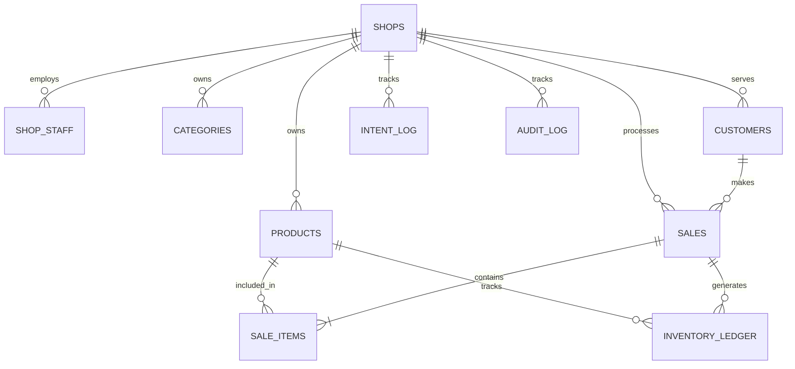

# Database Design Document — StoreMate

| Field        | Value                                              |
|--------------|----------------------------------------------------|
| Version      | 1.4                                                |
| Status       | Locked                                             |
| Owner        | Pratik Khose                                       |
| Last Updated | 2026-09-09                                         |
| Audience     | Database Administrators, Backend Engineers         |
| Dependencies | 03-System-Architecture.md (v1.2)                   |

> [!IMPORTANT]
> This document defines the exact PostgreSQL schema, constraints, Row Level Security (RLS) policies, and multi-tenant partitioning strategies for StoreMate. It serves as the finalized engineering blueprint for the database layer.

---

## 1. Database Philosophies & Naming Conventions

### 1.1 Structural Philosophy
- **Business validation** belongs exclusively in **RPCs**.
- **Structural validation** belongs exclusively in **Constraints**.
- **Automation & Projections** belong exclusively in **Triggers**.
- **Ledgers** are the authoritative source of truth. **Projections** (e.g., current stock) can always be dropped and rebuilt atomically from the ledger.

### 1.2 Naming Strategy
- **Tables:** `snake_case`, Plural (e.g., `products`, `sales`).
- **Views & Materialized Views:** `vw_[name]`, `mv_[name]`.
- **Primary Keys:** Always exactly `id`.
- **Foreign Keys:** Singular table name + `_id` (e.g., `product_id`).
- **Indexes:** `idx_[table]_[columns]`.
- **Constraints:** `chk_[table]_[rule]`, `uq_[table]_[rule]`, `fk_[table]_[reference]`.
- **Triggers:** `trg_[table]_[action]`.
- **Functions:** `fn_[action]`.
- **Policies (RLS):** `rls_[table]_[role]_[action]`.

### 1.3 Core Data Type Contracts
- **UUID Ownership:** Flutter generates `UUIDv4` for offline support. The database relies on `gen_random_uuid()` only as a fallback when the client omits it.
- **NULL Strategy:** NULL is preferred over empty strings. Missing data = `NULL`. Never store `""`.
- **Timezone Contract:** All timestamps are `TIMESTAMPTZ` and stored exclusively in **UTC**. The database never stores local timezones. Flutter handles all timezone conversions.
- **JSON Fields Policy:** `JSONB` is permitted **only** for `metadata`, API responses (e.g., `intent_log`), and app `settings`. It is strictly forbidden to store transactional ledger or inventory data inside JSON.

### 1.4 Decimal Precision Contract
- **Financial Values:** `DECIMAL(12,2)`.
- **Quantities/Weights:** `DECIMAL(12,3)`.
- **Serialization Rule:** Money is **never** serialized or computed as a floating-point `double` in Dart. It must be serialized as `String` over the network and parsed using fixed-precision decimal libraries in Flutter.

---

## 2. Global Table Contracts

### 2.1 Table Categorization Matrix
Not all tables require the same audit overhead. Every mutable tenant-owned business entity table follows this contract unless explicitly documented otherwise:

| Category | Description | Required Columns |
| --- | --- | --- |
| **Transactional Tables** | High-volume ledgers (`sales`, `inventory_ledger`). | `id`, `shop_id`, `created_at`, `created_by`, `change_reason`. (No `updated_at`, no `is_deleted` because they are append-only). |
| **Master Data Tables** | Configurable entities (`products`, `customers`). | `id`, `shop_id`, `created_at`, `updated_at`, `created_by`, `updated_by`, `is_deleted`, `deleted_at`, `deleted_by`, `version`. |
| **Projection Tables** | Derived views (`current_stock_projection`). | Minimal audit. `shop_id`, `last_updated`. (No soft delete, no `created_by`). |
| **Lookup Tables** | Static config (`tax_rates`). | `id`, `name`. No soft delete, no audit columns required. |

```sql
CREATE TABLE shops (
    id UUID PRIMARY KEY DEFAULT gen_random_uuid(),
    name TEXT NOT NULL CHECK (char_length(name) <= 100),
    gst_number TEXT,
    timezone TEXT NOT NULL DEFAULT 'UTC', -- Required for yearly invoice resets
    created_at TIMESTAMPTZ DEFAULT now()
);
```

### 2.2 Versioning & Sync Lifecycle Semantics
For Master Data tables, the `version` column drives Etags and sync conflict resolution:
- **INSERT:** `version = 1`.
- **UPDATE:** `version = version + 1`.
- **Soft Delete:** `version = version + 1`.
- **Conflict Resolution:** Highest version wins, or Server always wins (dependent on exact RPC rules). Projection tables ignore versions.

### 2.3 Trigger Ownership (Automated Audit)
The columns `updated_at` and `updated_by` are strictly managed via database triggers, **never** by application or RPC logic.
```sql
CREATE TRIGGER trg_products_set_updated
BEFORE UPDATE ON products
FOR EACH ROW EXECUTE FUNCTION fn_set_audit_columns();
-- fn_set_audit_columns automatically sets updated_at = now() and updated_by = auth.uid()
```

---

## 3. Relational Contracts

### 3.1 Foreign Key Behavior Matrix
Every Foreign Key **MUST** be explicitly indexed to prevent performance slowdowns during cascading deletes or joins.

| Parent Table | Child Table | On Delete Action | Rationale |
| --- | --- | --- | --- |
| `shops` | `shop_staff` | **CASCADE** | If shop is deleted, wipe staff access. |
| `products` | `sale_items` | **RESTRICT** | Cannot delete product if financial history exists. |
| `customers` | `sales` | **RESTRICT** | Cannot orphan a sale. |
| `categories`| `products` | **RESTRICT** | Must manually reassign or nullify products first. |
| `sales` | `refunds` | **RESTRICT** | Cannot orphan a refund. |

### 3.2 Soft Delete Contract
- Deleted master data (`is_deleted = true`) is hidden from active UI selections (e.g., POS catalog). This is typically enforced via `vw_active_products` views rather than raw table querying to prevent frontend leakage.
- **Historic Visibility:** Soft-deleted records (e.g., products, customers) remain strictly visible on historical sales/invoices via Foreign Keys to preserve financial integrity.

### 3.3 Unique Constraints & Invoice Rules
- **Global Uniqueness:** Customer phone numbers are unique per `shop_id`. SKUs/Barcodes are unique per `shop_id` (`WHERE is_deleted = false`).
- **Invoice Reset Contract:** Invoices follow `INV-YYYY-######`. They reset yearly based on the shop's local timezone (captured at sale time) to prevent midnight concurrency overlaps.
  - To prevent locking the entire `sales` table, sequence generation uses a dedicated `invoice_sequences(shop_id, current_year, last_value)` table, atomically incremented inside the `rpc_process_sale`.

---

## 4. Multi-Tenancy & Security (RLS)

### 4.1 RLS Bypass Policy
- **Never disable RLS.** 
- If a system action must bypass RLS, it is permitted **only** inside a `SECURITY DEFINER` RPC.

### 4.2 Full CRUD RLS Coverage
Every tenant table must implement explicitly defined policies for SELECT, INSERT, UPDATE, and DELETE (or intentionally omit them).

```sql
-- Helper function (future-proofed to eventually check JWT claims for multi-shop)
CREATE FUNCTION fn_get_active_shop_id() RETURNS UUID AS $$
  -- Currently relies on shop_staff table, but can be updated to pull from current_setting('request.jwt.claim.active_shop_id', true)
  SELECT shop_id FROM shop_staff 
  WHERE user_id = auth.uid() AND is_active = true LIMIT 1;
$$ LANGUAGE sql STABLE;

-- SELECT
CREATE POLICY rls_products_select ON products FOR SELECT USING (shop_id = fn_get_active_shop_id());
-- INSERT
CREATE POLICY rls_products_insert ON products FOR INSERT WITH CHECK (shop_id = fn_get_active_shop_id());
-- UPDATE
CREATE POLICY rls_products_update ON products FOR UPDATE USING (shop_id = fn_get_active_shop_id()) WITH CHECK (shop_id = fn_get_active_shop_id());
-- DELETE (Omitted for Master Data due to Soft Deletes)
```

### 4.3 Mandatory Comprehensive Indexing
To support 1M+ ledger rows without degradation, the following indexes are strictly mandated:
```sql
CREATE INDEX idx_sales_shop_created ON sales(shop_id, business_timestamp DESC);
CREATE INDEX idx_sales_customer ON sales(customer_id);
CREATE INDEX idx_inventory_shop_created ON inventory_ledger(product_id, created_at DESC);
CREATE INDEX idx_inventory_ref ON inventory_ledger(reference_id);
CREATE INDEX idx_sale_items_sale ON sale_items(sale_id);
CREATE INDEX idx_sale_items_product ON sale_items(product_id);
CREATE UNIQUE INDEX idx_customers_shop_phone ON customers(shop_id, phone);
CREATE INDEX idx_products_shop_cat ON products(shop_id, category_id);
CREATE INDEX idx_staff_user_active ON shop_staff(user_id, is_active);
CREATE INDEX idx_intent_shop_processed ON intent_log(shop_id, processed_at);
CREATE INDEX idx_stock_proj_shop_prod ON current_stock_projection(shop_id, product_id);
```

---

## 5. Constraint & Trigger Contracts

### 5.1 Check Constraints (Inventory Integrity)
Structural validation prevents malformed inventory signs natively.
```sql
ALTER TABLE products ADD CONSTRAINT chk_products_price_positive CHECK (selling_price >= 0);
ALTER TABLE sale_items ADD CONSTRAINT chk_sale_qty_positive CHECK (quantity > 0);
ALTER TABLE sales ADD CONSTRAINT chk_sales_discount_valid CHECK (discount_total <= subtotal);

-- Enforce explicit signs on inventory events
ALTER TABLE inventory_ledger ADD CONSTRAINT chk_inventory_direction CHECK (
    (event_type IN ('purchase', 'refund') AND quantity_change > 0) OR
    (event_type IN ('sale', 'damage') AND quantity_change < 0) OR
    (event_type = 'adjustment') -- Can be positive or negative
);
```

### 5.2 Negative Inventory Contract
Offline architectures demand that physical reality wins. The `current_stock_projection` is explicitly allowed to drop into negative values. There is **no** `CHECK (current_quantity >= 0)` constraint on the projection table.

### 5.3 Projection Refresh Recovery
If the stock projection table becomes corrupted, the system relies on an atomic swap to prevent temporary empty reads in production:
```text
CREATE current_stock_projection_new $\rightarrow$ Populate from Ledger $\rightarrow$ Swap Names $\rightarrow$ DROP old
```

---

## 6. Ledger Architecture (Append-Only)

### 6.1 `intent_log` (Server-side Idempotency)
```sql
CREATE TABLE intent_log (
    intent_id UUID PRIMARY KEY,
    shop_id UUID NOT NULL REFERENCES shops(id),
    rpc_name TEXT NOT NULL,
    processed_at TIMESTAMPTZ DEFAULT now(),
    response_payload JSONB
);
```
- **Amnesia Rule:** If a client syncs an `intent_id` that is older than 30 days, the RPC rejects it entirely, preventing execution of duplicate intents whose idempotency logs were purged.

### 6.2 Immutable Audit Log
To capture historical context beyond basic `updated_at`, an immutable audit log tracks Master Data and Settings mutations. Financial/Inventory Ledgers serve as their own audit trails.
```sql
CREATE TABLE audit_log (
    id UUID PRIMARY KEY DEFAULT gen_random_uuid(),
    shop_id UUID NOT NULL REFERENCES shops(id),
    entity_table TEXT NOT NULL,
    entity_id UUID NOT NULL,
    operation TEXT NOT NULL, -- INSERT, UPDATE, DELETE
    before_state JSONB,
    after_state JSONB,
    actor_id UUID REFERENCES auth.users(id),
    created_at TIMESTAMPTZ DEFAULT now()
);
```

### 6.3 Financial Ledger & Inventory Ledger
StoreMate never uses `UPDATE products SET stock = stock - X`. Ledgers are append-only.
```sql
CREATE TABLE inventory_ledger (
    id UUID PRIMARY KEY DEFAULT gen_random_uuid(),
    shop_id UUID NOT NULL REFERENCES shops(id),
    product_id UUID NOT NULL REFERENCES products(id),
    event_type inventory_event_type NOT NULL,
    quantity_change DECIMAL(12,3) NOT NULL, -- Checked by chk_inventory_direction
    change_reason TEXT, -- Critical for adjustments
    reference_id UUID,
    created_at TIMESTAMPTZ DEFAULT now(),
    created_by UUID REFERENCES auth.users(id)
);
```

---

## 7. Migration & Operational Policy

### 7.1 Database Folder Structure
```text
supabase/
 ├── migrations/      # Sequential SQL patches
 ├── functions/       # RPC definitions
 ├── policies/        # RLS separation
 ├── triggers/        # Ledger aggregations
 ├── views/           # Analytics views
 └── seed/            # Environment defaults
```

### 7.2 Migration Policy
- **Naming:** `YYYYMMDDHHMMSS_description.sql`.
- **Immutability:** Migrations are immutable and sequential. Defensive clauses (`IF NOT EXISTS`) may be used only where safe and intentional, not as a substitute for migration correctness.
- **Rollbacks Unsupported:** If a migration corrupts local SQLite, the app wipes the cache and rebuilds.

### 7.3 Seed Philosophy
Data seeds are strictly separated by environment:
- **Production Seed:** Default roles, base tax rates, system config.
- **Development Seed:** 50 products, 1 shop, dummy staff.
- **Test Fixtures:** Minimal targeted scenarios for integration tests.

### 7.4 Operational Readiness
- **Partitioning Strategy:** As the dataset grows, `inventory_ledger`, `sales`, and `audit_log` are the primary candidates for list partitioning by `shop_id` or range partitioning by `created_at`.
- **Vacuum Strategy:** Autovacuum is enabled by default. DBA monitors bloat and runs `ANALYZE` weekly on high-churn projection tables.
- **Backup Strategy:** Automated `pg_dump` via Supabase daily. Point-in-Time Recovery (PITR) enabled. 30-day retention for transaction logs.

---

## 8. Entity Relationship Diagram


